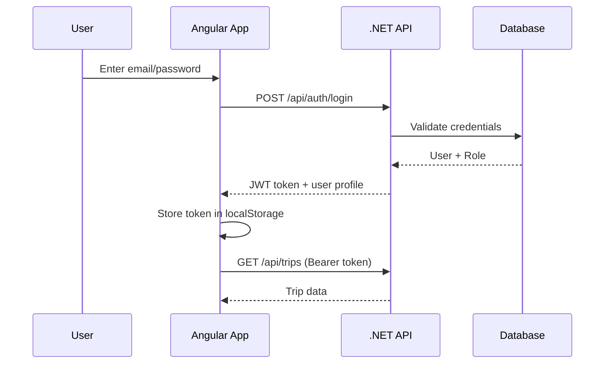

# Truck Transport Hub — Architecture Guide

This document explains how the Angular frontend connects to the planned .NET backend, authentication, and the path to a mobile app.

## Current Frontend (Phase 1 — Complete)

**Location:** `truck-transport-frontend/`

The frontend is a standalone Angular 19 application with:

- **Login** — mock JWT-style auth (localStorage)
- **Dashboard** — trip summary and recent records
- **Trip Records** — full data table with multi-field filtering
- **New/Edit Trip** — form for all required fields
- **Administration** — admin-only area (role guard in place)

### Data fields captured

| Field | Type | Notes |
|-------|------|-------|
| Date | date | Trip date |
| Shift | Day / Night | Day or night operation |
| Truck Number | string | Vehicle registration |
| Quarry / Crusher | string | Source location name |
| Tonnes | decimal | Load weight |
| Driver Name | string | |
| Driver Phone | string | |
| Driver License | string | |
| Start Time | time | |
| End Time | time | |

### Demo accounts

| Role | Email | Password |
|------|-------|----------|
| Admin | admin@transport.com | admin123 |
| User | user@transport.com | user123 |

### Run locally

```bash
cd truck-transport-frontend
npm install
npm start
```

Open http://localhost:4200

---

## Recommended System Architecture

```
┌─────────────────┐     HTTPS + JWT      ┌──────────────────────┐
│  Angular Web    │ ◄──────────────────► │  .NET 8 Web API      │
│  (this project) │                      │  (ASP.NET Core)      │
└────────┬────────┘                      └──────────┬───────────┘
         │                                          │
         │  Same REST API                           │  EF Core
         │                                          ▼
┌────────▼────────┐                      ┌──────────────────────┐
│  Mobile App     │                      │  SQL Server /        │
│  (Ionic or      │                      │  PostgreSQL          │
│   .NET MAUI)    │                      └──────────────────────┘
└─────────────────┘
```

---

## .NET Backend Structure (Phase 2)

Create a solution alongside the frontend:

```
truck-transport-hub/
├── truck-transport-frontend/     ← Angular (done)
└── truck-transport-api/          ← .NET Web API (next)
    ├── Controllers/
    │   ├── AuthController.cs
    │   ├── TripsController.cs
    │   └── UsersController.cs
    ├── Models/
    ├── Data/
    │   └── AppDbContext.cs
    ├── Services/
    └── Program.cs
```

### Suggested NuGet packages

- `Microsoft.AspNetCore.Authentication.JwtBearer`
- `Microsoft.EntityFrameworkCore.SqlServer` (or Npgsql)
- `Microsoft.AspNetCore.Identity.EntityFrameworkCore`

### API endpoints

#### Authentication

```
POST /api/auth/login
Body: { "email": "...", "password": "..." }
Response: { "token": "...", "user": { "id", "email", "fullName", "role" } }

POST /api/auth/refresh
GET  /api/auth/me
```

#### Trips

```
GET    /api/trips?dateFrom=&dateTo=&shift=&truckNumber=&quarryName=&driverName=&minTonnes=&maxTonnes=
GET    /api/trips/{id}
POST   /api/trips
PUT    /api/trips/{id}
DELETE /api/trips/{id}          ← Admin only
GET    /api/trips/summary       ← Dashboard stats
```

#### Users (Admin only)

```
GET    /api/users
POST   /api/users
PUT    /api/users/{id}
DELETE /api/users/{id}
```

### Database entities

**User**
- Id, Email, PasswordHash, FullName, Role (Admin/User), IsActive, CreatedAt

**TransportTrip**
- Id, Date, Shift, TruckNumber, QuarryName, Tonnes
- DriverName, DriverPhone, DriverLicense
- StartTime, EndTime
- CreatedByUserId, CreatedAt, UpdatedAt

---

## Connecting Angular to .NET

### 1. Configure API URL

Edit `src/environments/environment.development.ts`:

```typescript
apiUrl: 'https://localhost:7001/api'
```

### 2. Enable CORS in .NET (`Program.cs`)

```csharp
builder.Services.AddCors(options =>
{
    options.AddPolicy("Angular", policy =>
        policy.WithOrigins("http://localhost:4200")
              .AllowAnyHeader()
              .AllowAnyMethod());
});

// after app.Build():
app.UseCors("Angular");
```

### 3. Replace mock services with HTTP calls

Update `TransportService` to use `HttpClient`:

```typescript
import { HttpClient, HttpParams } from '@angular/common/http';
import { environment } from '../../../environments/environment';

getAll(filters?: TripFilter): Observable<TransportTrip[]> {
  let params = new HttpParams();
  if (filters?.dateFrom) params = params.set('dateFrom', filters.dateFrom);
  // ... other filters
  return this.http.get<TransportTrip[]>(`${environment.apiUrl}/trips`, { params });
}
```

Update `AuthService.login()`:

```typescript
return this.http.post<LoginResponse>(`${environment.apiUrl}/auth/login`, request)
  .pipe(tap(res => { /* store token + user */ }));
```

The `authInterceptor` already attaches `Authorization: Bearer <token>` to every request.

### 4. Role-based authorization

**Frontend:** `authGuard` and `adminGuard` (already implemented)

**.NET:** Use `[Authorize(Roles = "Admin")]` on controllers/actions:

```csharp
[Authorize(Roles = "Admin")]
[HttpDelete("{id}")]
public async Task<IActionResult> Delete(Guid id) { ... }
```

---

## Authentication Flow



---

## Mobile App Path (Phase 3)

**Recommended: Ionic + Angular (Capacitor)**

Because you already use Angular, Ionic lets you reuse:

- Models (`transport-trip.model.ts`)
- Services (with minor changes)
- Business logic and validation
- API integration

Steps:
1. `npm install -g @ionic/cli`
2. `ionic start truck-transport-mobile blank --type=angular`
3. Copy `core/` folder from this project
4. Rebuild UI with Ionic components (mobile-first)
5. `ionic capacitor add android` / `ios`
6. Build native apps from the same .NET API

**Alternative: .NET MAUI** — good if you prefer C# everywhere; requires rewriting the UI layer.

---

## Deployment

| Layer | Suggestion |
|-------|------------|
| Frontend | Azure Static Web Apps, Netlify, or nginx on VPS |
| API | Azure App Service, IIS, or Docker container |
| Database | Azure SQL or self-hosted SQL Server |
| Mobile | Google Play Store / Apple App Store via Capacitor builds |

---

## Next Steps

1. **You:** Review the frontend — run `npm start` and test all screens
2. **Next session:** Scaffold the .NET 8 Web API with JWT auth and EF Core
3. **Then:** Swap mock services for real HTTP calls
4. **Finally:** Start Ionic mobile shell sharing the same API
